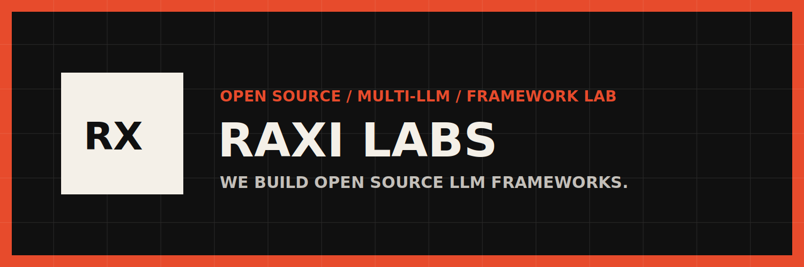

<p align="center">
  
</p>

<h1 align="center">Raxi Court</h1>

<p align="center">
  Open-source multi-LLM verification from Raxi Labs.
</p>

<p align="center">
  
  
  
  <a href="https://raxi-labs.netlify.app"></a>
  <a href="https://github.com/RaxiLabs/raxi-council/commits"></a>
  <a href="https://github.com/RaxiLabs/raxi-council"></a>
  <a href="https://github.com/RaxiLabs/raxi-council/stargazers"></a>
</p>

<p align="center">
  <a href="#current-capabilities"><strong>Capabilities</strong></a> ·
  <a href="#setup"><strong>Setup</strong></a> ·
  <a href="#usage"><strong>Usage</strong></a> ·
  <a href="#configuration"><strong>Configuration</strong></a> ·
  <a href="#project-structure"><strong>Project Structure</strong></a>
</p>

Raxi Court is an experimental multi-LLM verification CLI. It runs multiple models on the same prompt, anonymizes their responses, scores them with separate arbiter roles, and saves a traceable Markdown report with final scores, hallucination flags, disagreement signals, semantic agreement, token usage, and estimated cost.

The current project is intentionally small: one interactive CLI entry point, a few source modules, plain-text arbiter prompts, response caching, and generated reports in `results/`.

## At a Glance

- Multi-model answer generation through OpenRouter
- Anonymous A/B/C response evaluation
- Separate arbiter personas for scoring
- Hallucination and disagreement flagging
- Semantic entropy for response agreement
- Token budgeting, caching, and report export

## Quick Start

```bash
python3 -m venv venv
source venv/bin/activate
pip install -r requirements.txt
cp .env.example .env
python3 main.py
```

## Current Capabilities

- Generates candidate answers from multiple OpenRouter models.
- Shuffles and anonymizes responses before evaluation.
- Evaluates responses with three arbiter personas: sceptic, expert, and logician.
- Scores factual accuracy, completeness, and reasoning quality.
- Selects the best response using weighted arbiter scores.
- Flags hallucination concerns reported by arbiters.
- Flags arbiter disagreement when score spread, variance, hallucination votes, or semantic disagreement become significant.
- Runs a lightweight prompt safety check before calling generation models.
- Computes semantic entropy from response clusters to show agreement or disagreement.
- Tracks prompt tokens, completion tokens, total tokens, and estimated cost.
- Estimates token usage before each council stage and blocks runs projected to exceed a user budget.
- Retries API calls and malformed evaluator JSON where possible.
- Saves full Markdown reports under `results/`.

## How It Works

```text
User prompt
   |
   v
Safety check
   |
   v
Generate candidate responses
   |
   v
Anonymize and shuffle responses
   |
   v
Evaluate with arbiter personas
   |
   v
Aggregate weighted scores
   |
   v
Analyze semantic entropy
   |
   v
Save Markdown report
```

If a prompt matches the built-in harmful-instruction filters, the council run is blocked before model generation. A safety report is still saved so the blocked run remains auditable.

## Requirements

- Python 3.12 or newer
- An OpenRouter API key

Install dependencies with:

```bash
pip install -r requirements.txt
```

The project depends on:

- `requests`
- `python-dotenv`
- `colorama`
- `pytest`

## Setup

Create and activate a virtual environment:

```bash
python3 -m venv venv
source venv/bin/activate
```

On Windows PowerShell:

```powershell
python -m venv venv
.\venv\Scripts\Activate.ps1
```

Create your environment file:

```bash
cp .env.example .env
```

Then edit `.env`:

```env
OPENROUTER_API_KEY=sk-or-v1-your-real-key
```

`src/config.py` validates that the key exists and matches the expected OpenRouter key format.

## Usage

Run the interactive CLI:

```bash
python3 main.py
```

You will be prompted for:

| Input | Description | Default |
|---|---|---|
| Prompt | The question or task to evaluate | Required |
| Report name | Optional Markdown report filename | Timestamped filename |
| Threshold | Minimum final score required to accept a result | `60` |
| Max retries | Number of full council attempts before failing | `3` |
| Generation models k | Number of generation models to use | All configured models |
| Evaluation arbiters m | Number of arbiter personas to use | All configured arbiters |
| Max token budget | Optional total token cap checked against estimated and actual usage | None |

Example:

```text
Prompt : What causes inflation?
Report name (optional): inflation_test
Threshold (1-100, default 60): 75
Max retries (default 3): 3
Generation models k (2-3, default 3): 3
Evaluation arbiters m (1-3, default 3): 3
Max token budget (blank = none) :
```

## Output

The terminal prints a compact summary:

```text
Score       [final score]/100
Attempts    [attempt count]
Elapsed     [seconds]
Hallucin.   YES or NONE
Disagree.   YES or NONE
Models      k=[generation count] m=[arbiter count]
Sem Ent.    [normalized entropy]
Agreement   [agreement score]
Tokens      [total tokens]
Est. run    [estimated attempt tokens]
Cost        [estimated cost]
```

Each successful run saves a Markdown report in `results/`. Report filenames are either:

- `raxi_court_output_YYYYMMDD_HHMMSS.md`
- `[your_report_name].md`

Reports include:

- Run summary
- Original prompt
- Best response and original source model
- All anonymized responses
- Response scoreboard
- Arbiter evaluations for the winning response
- Aggregation details
- Hallucination policy result
- Disagreement status and reasons
- Semantic entropy clusters
- Token budget estimates compared with actual usage
- API usage and estimated cost

## Configuration

Most runtime settings live in `src/config.py`.

```python
GENERATION_MODELS = [
    "openai/gpt-4o-mini",
    "anthropic/claude-3-haiku",
    "google/gemini-2.5-flash-lite",
]

EVALUATION_MODELS = [
    "openai/gpt-5.4-nano",
    "anthropic/claude-sonnet-4-5",
    "mistralai/mistral-large-2411",
]

EVALUATION_PERSONAS = [
    "sceptic",
    "expert",
    "logician",
]
```

Scoring weights are also configured there:

```python
ARBITER_WEIGHTS = {
    "sceptic": 0.5,
    "expert": 0.25,
    "logician": 0.25,
}

DIMENSION_WEIGHTS = {
    "factual_accuracy": 0.5,
    "completeness": 0.25,
    "reasoning_quality": 0.25,
}
```

Other configurable values include request timeout, API retry counts, max output tokens, semantic entropy model, hallucination policy, output directory, and model pricing estimates.

## Arbiter Prompts

Arbiter behavior is controlled by plain-text prompt files:

```text
prompts/sceptic.txt
prompts/expert.txt
prompts/logician.txt
prompts/semantic_entropy.txt
```

Edit these files to change evaluation style without touching the Python code.

## Project Structure

```text
raxi-council/
|-- main.py                  # Interactive CLI entry point and terminal output
|-- requirements.txt         # Python dependencies
|-- .env.example             # Environment variable template
|-- prompts/
|   |-- sceptic.txt          # Sceptic arbiter prompt
|   |-- expert.txt           # Expert arbiter prompt
|   |-- logician.txt         # Logician arbiter prompt
|   `-- semantic_entropy.txt # Semantic clustering prompt
|-- results/
|   `-- .gitkeep             # Keeps results folder in the repo
`-- src/
    |-- agents.py            # OpenRouter calls, response generation, evaluation parsing
    |-- aggregator.py        # Weighted scoring and best-response selection
    |-- config.py            # Models, weights, API settings, pricing, paths
    |-- evaluator.py         # Main council execution flow
    |-- output.py            # Markdown report formatting and saving
    |-- safety.py            # Basic harmful-prompt filtering
    `-- semantic_entropy.py  # Semantic clustering and entropy metrics
```

## Important Notes

- This is currently an interactive CLI, not an installable Python package.
- The safety filter is intentionally minimal and regex-based.
- Semantic entropy uses LLM-assisted clustering plus a standard entropy calculation.
- Model pricing is estimated from the static values in `src/config.py`.
- Generated reports are ignored by Git, while `results/.gitkeep` keeps the folder present.
- Do not commit `.env`, virtual environments, or generated report files.
